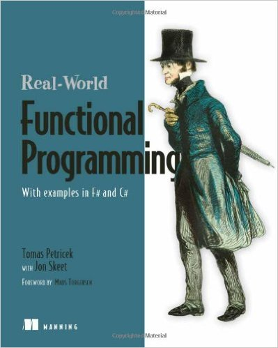
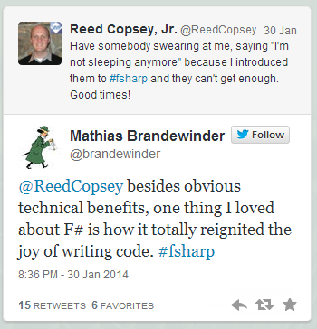
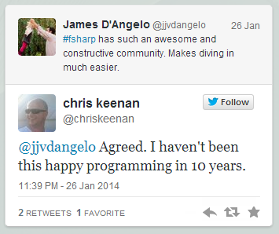
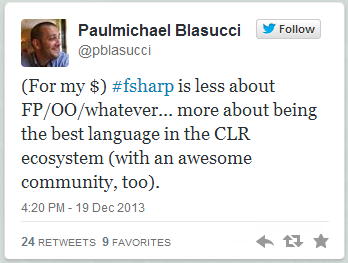
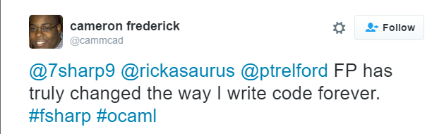

- title : Introduction to Functional Programming
- description : Introduction to Functional Programming
- author : Tomasz Heimowski
- theme : night
- transition : default

***

## F# CAMP

### Tomasz Heimowski

---

### Agenda

1. Introduction to the workshop series
2. What is Functional Programming
3. Why Functional Programming
4. Examples of functional concepts in C#

***

## Introduction to the workshop series

---

### Aim

* Learn F# language
* Discover Functional Programming concepts
* Have fun
* No prior F# / Functional Programming knowledge required - we're starting from scratch

---

### Format

* 4 meetings in July
    * first - introductory talk (this one, ~45min)
    * 2nd, 3rd, 4th - combined talk + workshops (45+90 ~= 2-2.5h)
* Each workshop will cover concepts from the preceding talk
* If it rolls out nicely, there'll be a continuation of the series

---

### Real World Functional Programming

https://amzn.com/1933988924

---

### Source for presentations 

* Agenda - http://gda-gitlab-01.globalintech.pl/theimowski/fsharp-workshops
* This presentation - http://gda-gitlab-01.globalintech.pl/theimowski/fsharp-workshops-intro

Presentation made by [FsReveal](http://fsprojects.github.io/FsReveal) 

---

### Prerequisites

Install F# for workshops

http://fsharp.org/use/windows/

If you have VS 2015, but no F# installed:

https://github.com/Microsoft/visualfsharp/issues/544#issuecomment-221505568

***

## What is Functional Programming

---

> Functional programming is a style of programming that emphasizes the evaluation of expressions, rather than execution of commands. The expressions in these languages are formed by using functions to combine basic values.

*Hutton*

---

### Statements vs Expressions

* Imperative style:
    * Statements
    * Commands
* Declarative style:
    * Expressions
    * Functional

https://twitter.com/mariofusco/status/571999216039542784

---

---

### Brief history

* First functional language: LISP (1958)
* ML (1970) - generic functions
* OCaml (1996) - hybrid language
* F# came live with VS 2010 

Other important FP languages: Haskell, Erlang, Scala, Clojure

***

## Why Functional Programming

---

### Prevent unwanted side effects

    [lang=csharp]
    public int TestA()
    {
        return 5 + 6;
    }

    public int TestA()
    {
        return Sum(5, 6);
    }

    public int Sum(int a, int b)
    {
        var result = a + b;
        Console.WriteLine("Result is {0}", result);
        return a + b;
    }

*"Referential transparency"*

---

### Make code more testable

    [lang=csharp]
    public decimal TestMe(decimal hourlyRate, decimal hours)
    {
        if (System.DateTime.Now.DayOfWeek = DayOfWeek.Saturday)
        {
            return hourlyRate * hours * 1.5M;
        }
        else if (System.DateTime.Now.DayOfWeek = DayOfWeek.Sunday)
        {
            return hourlyRate * hours * 2.0M;
        }
        else 
        {
            return hourlyRate * hours;
        }
    }

*"Isolation"*

---

### Generalize common patterns

    [lang=csharp]
    public int Sum(int[] numbers)
    {
        var sum = 0;
        for (int i = 0; i < numbers.Length; i = i+1)
        {
            sum = sum + numbers[i];
        }
        return sum;
    }

    public int Product(int[] numbers)
    {
        var product = 1;
        for (int i = 0; i < numbers.Length; i = i+1)
        {
            product = product * numbers[i];
        }
        return product;
    }

---

### Discover right abstractions

    [lang=csharp]
    class Rectangle 
    {
        public Rectangle(int width, int height)
        {
            this._width = width;
            this._height = height;
        }
    }

    // ok or not ok?
    class Square : Rectangle 
    {
        public Square(int width) : Rectangle(width, width)
        { 
        }
    }

---

### Inhale concurrency

    [lang=csharp]
    class ThreadSafeOrNot
    {
        static readonly object _monitor;
        Dictionary _field;

        public void Manipulate()
        {
            lock (_monitor)
            {
                DoSomething(_field);
            }
        }
    }

---

### Twitter reactions

---

### Twitter reactions

---

### Twitter reactions

---

### Twitter reactions

***

## Examples of functional concepts in C#

---

### Immutability

    [lang=csharp]
    class Age
    {
        readonly int _year;
        Age(int year)
        {
            _year = year;
        }
        void ChangeYear()
        {
            //_year = 1967; // Compile error if uncommented.
        }
    }

---

### Generics

    [lang=csharp]
    public class Stack<T> {
        readonly int m_Size; 
        int m_StackPointer = 0;
        T[] m_Items;
        public Stack(int size) {
            m_Size = size;
            m_Items = new T[m_Size];
        }
        public void Push(T item) {
            m_Items[m_StackPointer] = item;
            m_StackPointer++;
        }
        public T Pop() {
            m_StackPointer--;
            return m_Items[m_StackPointer];
        }
    }

---

### Lambda functions + LINQ

    [lang=csharp]
    public string OddStringsTogether(IEnumberable<int> numbers)
    {
        return
            numbers
                .Where(n => n % 2 == 1)         // filter
                .Select(n => n.ToString())      // map
                .Aggregate((n1,n2) => n1 + n2); // fold
    }

---

### Async / Await

    [lang=csharp]
    async Task<int> AccessTheWebAsync()
    { 
        HttpClient client = new HttpClient();
        Task<string> getStringTask = 
            client.GetStringAsync("http://msdn.microsoft.com");
        DoIndependentWork();
        string urlContents = await getStringTask;
        return urlContents.Length;
    }

***

## Summary

* F# is a functional-first language available on .NET
* FP helps you to write better code
* Multi-paradigm languages (e.g. C#) also make use of functional bits
* It's worth to learn F# / FP - even if you just want to improve how you write code in non-FP languages

***

## Next Week

### Basic concepts of Functional Programming 

### talk + workshop

* Immutability
* Recursion
* Expression-oriented programming
